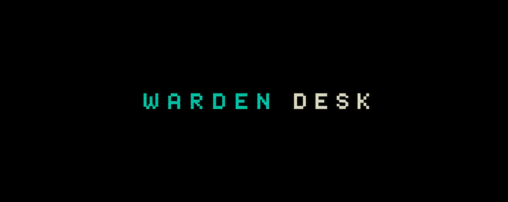

# 

[](LICENSE)
[](requirements.txt)
[](rules.json)
[](https://github.com/Vlad9811/warden-desk/actions/workflows/ci.yml)
[](.env.example)
[](#what-this-is-not)

An eight-agent rule engine for on-chain risk analysis. Seven agents spend the
day looking for a reason to act. The eighth exists only to refuse, and there is
no manual override.

The desk does not trade. It finds, it measures, and it says no - out loud,
with the rule and the contract address attached. Refusals are appended to
`data/refusals.jsonl` for the same reason trades get written down: so the
record can be checked later against what those coins actually did.

**Not for production.** This is a decision layer, not a trading bot. There is
no execution code here, no wallet handling and no performance claim. If you
want the part that submits transactions, that is a separate problem with
separate ways to lose money - see [What this is not](#what-this-is-not).

**On the commit history.** It starts the day this was published, and that is
the whole story: the rules were extracted from a private research repo that
has been running since July 2026 - 250+ commits of trajectory recording and
measurement that stay closed, because they carry live wallets. What landed
here is the decision layer, rewritten to run on public endpoints with no keys
of its own. The seven thresholds in [`rules.json`](rules.json) are the output
of that work, not guesses.

```
╭──────────────────────────────────────────────────────────────────────────────╮
│ WARDEN   the agent that says no                                              │
│ asks     if i buy this, who buys it from me?                                 │
│ bench    R1 GRAVEYARD  R2 MIDWIFE  R3 COLLECTOR  R4 CLOCK  R5 TOLL  …        │
╰─────────────────────────────────────── 128 candidates · a denial is final ───╯

┏━━━┳━━━━━━━━━━━━┳━━━━━━━━━┳━━━━━━━━━━━━━━━━━┳━━━━━━━━━┳━━━━━━━┳━━━━━━━━┳━━━━━━━━━┓
┃   ┃TICKER      ┃VERDICT  ┃RULE             ┃ HOLDERS ┃ TOP10 ┃ SILENT ┃     CAP ┃
┡━━━╇━━━━━━━━━━━━╇━━━━━━━━━╇━━━━━━━━━━━━━━━━━╇━━━━━━━━━╇━━━━━━━╇━━━━━━━━╇━━━━━━━━━┩
│✗  │$GOOB       │DENIED   │no counterparty  │       2 │    0% │   354d │  $5,617 │
│✗  │$SIA        │DENIED   │no counterparty  │       2 │    0% │   613d │  $5,211 │
│✗  │$APE        │DENIED   │book is dead     │      26 │    0% │    69d │  $2,012 │
│✓  │$BOL        │CLEARED  │                 │     756 │   23% │     0d │ $39,731 │
└───┴────────────┴─────────┴─────────────────┴─────────┴───────┴────────┴─────────┘

╭─ session ────────────────────────────────────────────────────────────────────╮
│ 128  candidates    3  cleared    125  denied    98%  refusal rate            │
│                                                                              │
│   94 ████████████████████████ no counterparty                                │
│   10 ███                      size moves it                                  │
│   10 ███                      exit is one wallet                             │
│    7 ██                       book is dead                                   │
╰────────────────────────────────────── written to data/refusals.jsonl ────────╯
```

## Why a desk that refuses

Every trading bot people publish is an optimist. It scans, it enters, it shows
a green candle. Nobody posts the trade their bot **refused**, for a boring
reason: a refusal has no chart. There is nothing to screenshot.

The measured median holding time of the operator this was built for was **42
seconds**, and the loss came from leaving winners early, over and over. The
hard problem was never finding a coin - thousands launch daily and half of
them move. The hard problem was the person clicking the button.

Hence an agent whose whole job is to say no, and a desk with no manual mode.

## The seven rules

They live in one file, [`rules.json`](rules.json). Nothing in the code
hard-codes a threshold - every agent reads its numbers from there, so all
seven can be read, diffed and argued with in one screen.

| # | Agent | Asks | Refuses when |
|---|-------|------|--------------|
| **R1** | `GRAVEYARD` | is this coin actually on the floor of an empty curve? | it is still bid, or too young to be a corpse |
| **R2** | `MIDWIFE` | is someone manufacturing a wave on this ticker right now? | thin wave · spread over days · one wallet spamming itself |
| **R3** | `COLLECTOR` | am i about to buy the corpse, or a copy of it? | the target is a clone, or the original already moved |
| **R4** | `CLOCK` | has the position been held long enough to close? | a manual exit inside the 5 minute lock, stop not fired |
| **R5** | `TOLL` | is the hour's fee bill eating the hour's profit? | fees this hour exceed half the profit this hour |
| **R6** | `LADDER` | is this position in profit before i add to it? | any add to a loser - averaging down, banned outright |
| **R7** | `UNDERTAKER` | has the reason for this trade expired? | held past the 6 hour thesis timer |

Each entry says what it `asks`, what it `denies`, its `params`, and a `source`
naming where the number came from. That last field matters: six months on,
nobody remembers whether `min_holders: 25` was measured or invented on a
Tuesday, and a threshold nobody can trace is a threshold nobody can argue with.

```json
{
  "id": "R6",
  "agent": "LADDER",
  "title": "add to winners only",
  "asks": "is this position already in profit before i add to it?",
  "params": {
    "add_only_if_open_pnl_pct_above": 0.0,
    "averaging_down": false,
    "max_adds": 3,
    "add_size_fraction": 0.5
  },
  "denies": "any add to a losing position - averaging down is a desk-level ban with no override",
  "source": "post 2026-08-25 (adds only to a profitable position, averaging down forbidden)"
}
```

## Quick start

### 1. Requirements

Python 3.10 or newer. One dependency, `rich`, for the tables.

### 2. Clone and install

```bash
git clone git@github.com:Vlad9811/warden-desk.git
cd warden-desk
pip install -e .
```

That puts a `warden-desk` command on your path; `python3 desk.py` works the
same way from the clone, and every example below uses the second form so it
runs with nothing installed but `rich`.

### 3. Check what you are standing on

```bash
python3 desk.py rules      # the seven rules, one panel each
python3 desk.py index      # the bundled launch snapshot
```

No keys, no wallet, no sign-up. A snapshot of the launch feed ships with the
repository, so everything below runs offline on a fresh clone.

### 4. Run the desk

```bash
python3 desk.py warden           # judge the bundled candidates
python3 desk.py warden --log     # one verdict at a time, slowly
python3 desk.py warden --table   # csv of every verdict, contracts included
python3 desk.py warden --live    # find fresh waves and rule on them
```

Every agent also runs on its own:

```bash
python3 desk.py midwife --window 6h --min-copies 8   # waves in the index
python3 desk.py graveyard --ticker MICHU             # is this ticker buried
python3 desk.py collector --top 5 --save             # build candidates
python3 desk.py clock --held 42 --pnl -4             # would this sell pass
python3 desk.py toll --profit 6 --fees 4             # is the toll winning
python3 desk.py ladder --pnl -8                      # would this add pass
python3 desk.py undertaker --held 7h                 # has the thesis expired
```

> On the bundled snapshot `--live` mostly answers `R2 wave is over`. That is
> correct, not broken: the snapshot is a historical slice and those waves
> finished being minted days ago. Point `DESK_INDEX` at a live index for
> current ones.

## The eight agents

Full walkthrough with code and output: **[docs/agents.md](docs/agents.md)**.

| Agent | One line |
|---|---|
| `GRAVEYARD` | indexes coins that died on the floor of an empty curve, around $1,800 |
| `MIDWIFE` | counts names, not candles: 49 mints of one ticker in 6h is production, not a market |
| `COLLECTOR` | takes the original the crowd is copying, never a copy, never one that already ran |
| `CLOCK` | keeps the sell button locked for five minutes; only the stop opens it early |
| `TOLL` | counts 1.25% each side live, and freezes entries when fees beat profit |
| `LADDER` | adds to a position only while it is winning; averaging down is banned |
| `UNDERTAKER` | closes at market when the six hour thesis timer runs out |
| `WARDEN` | runs all seven on every order, then asks who buys this from me |

They share one interface. An agent is a class with a single method:

```python
class Ladder(Agent):
    name = "LADDER"
    rule_id = "R6"

    def check(self, order: Order) -> Verdict:
        if order.action != "add":
            return self.ok()

        position = order.position
        if position is None:
            return self.unknown("the position being added to")

        threshold = self.rule["add_only_if_open_pnl_pct_above"]
        if not self.rule["averaging_down"] and position.pnl_pct <= threshold:
            return self.no(
                "averaging down",
                f"${position.ticker} is at {position.pnl_pct:+.1f}% - "
                "the desk does not add to a losing position, and this rule "
                "has no override",
            )
        return self.ok()
```

Verdicts are `ok()`, `no(code, reason)`, or `unknown(what)` - a refusal meaning
the rule could not read its input. Reasons are written as sentences on purpose:
`DENY_R6` tells you nothing six months later.

## The data

`data/coins.sqlite` is a snapshot of the Solana launch feed - public on-chain
facts only:

| | |
|---|---|
| launches | 12,663 |
| distinct tickers | 4,883 |
| deployer wallets | 7,963 |
| period covered | 8.5 days |
| size | 3.8 MB |

```sql
create table coins (
    mint             text primary key,
    ticker           text not null,
    deployer         text,
    born             real not null,   -- unix seconds, launch time
    launchpad        text,
    source           text,            -- social link the coin was minted from
    cap_at_index     real,
    holders_at_index integer,
    top10_at_index   real,
    indexed_at       real
);
```

`data/catch.jsonl` holds 128 candidates the collector caught, so
`python3 desk.py warden` produces verdicts on a fresh clone with no network at
all.

MIDWIFE runs entirely against that file, and reports what it threw away:

```
╭─ session ────────────────────────────────────────────────────────────────────╮
│ 4882  names    42  waves    4840  rejected    99%  refusal rate              │
│                                                                              │
│ 4620 ████████████████████████ too few copies                                 │
│  103 █                        spread over days                               │
│   93 █                        no original to buy                             │
│   24 █                        one wallet spamming                            │
╰──────────────────────────────── index covers 8.5 days of launches ───────────╯
```

A filter that does not say what it discarded is indistinguishable from a
broken one.

## Output

`data/refusals.jsonl` - one line per refusal, appended. The candidate is stored
alongside the verdict, so a refusal can be re-judged later without trusting
today's numbers:

```json
{"at": 1787816075.96651, "action": "buy", "ticker": "GOOB",
 "mint": "BgmCuReJVhJ7k8BzSvqqVovWxobRKpVrTw1cT7GZQHoA",
 "rule": "R0", "agent": "WARDEN", "code": "no counterparty",
 "reason": "2 holders - there is nobody to sell to",
 "candidate": {"cap_usd": 5617, "holders": 2, "holders_exact": true,
               "top10_share": 0.0, "silence_days": 354, "age_days": 878,
               "clones": 14, "is_original": true, "moved_pct": 0.0}}
```

`--table` - CSV of every verdict, for publishing:

```csv
verdict,ticker,rule,agent,code,holders,top10,silent_days,cap_usd,contract
DENIED,GOOB,R0,WARDEN,"no counterparty",2,0.0,354,5617,BgmCuReJ...
CLEARED,BOL,R0,WARDEN,"",756,0.229,0,39731,JDjprgWY...
```

Both carry the contract address, which is the point. A month later anyone can
look up what those coins did and tell the desk its rules were wrong.

**Exit codes.** Every agent exits `0` when it clears the order and `1` when it
refuses, so the desk composes with anything else you run:

```bash
python3 desk.py warden --table --no-save > verdicts.csv || echo "nothing cleared"
```

**The counts in this README come from the bundled snapshot** - 128 candidates
the collector had accumulated. A single day's live run is a much smaller batch,
so `--live` will print different numbers. The refusal *rate* is the stable part;
the batch size is not.

## Configuration

Everything is optional. Copy `.env.example` to `.env`, or export directly.

| Variable | What it does |
|---|---|
| `DESK_RPC` | your Solana node - the only way to read holders and top-10 live |
| `DESK_PROXY` | route requests through a proxy (`HTTPS_PROXY` also works) |
| `DESK_RULES` | path to a different rules file |
| `DESK_INDEX` | path to a different launch index |
| `DESK_CATCH` | where candidates are read from and written to |
| `DESK_REFUSALS` | where refusals are logged |
| `DESK_CANDLE_CACHE` | where the candle cache lives |

There is no key that unlocks trading, because this repository does not trade.

## Honest limitations

**The refusal rate is 98%, and that is not the market being bad.** It is two
filters pulling in opposite directions. GRAVEYARD looks for an old corpse with
a thick wave of clones on its name; WARDEN requires a live order book. The
median candidate has **5 holders and has not traded in 26 days**. So on 98% of
finds, one half of the desk tells the other half that what it found is
unsellable. That number is printed rather than tuned away, because it is the
most useful thing this project has measured.

**Holders need your own node, and without one the desk refuses.**
`getTokenLargestAccounts` is an indexed RPC call: `api.mainnet-beta.solana.com`
answers `429` every time, and `solana-rpc.publicnode.com` wants a personal
token. With no `DESK_RPC` set, holders read as unknown - and unknown is a
refusal:

```python
if candidate.holders is None:
    return self.no(
        "counterparty unknown",
        "holders could not be read - an unknown counterparty is refused "
        "like a missing one",
    )
```

Fail-closed is the character of the agent. A rule that quietly stops applying
whenever an API is down is a rule-shaped hole that opens exactly when things
are going badly.

**The bundled index is a historical slice**, roughly eight days wide. Enough to
demonstrate every rule and to run the whole chain offline; not a live feed, and
the desk says so rather than pretending.

**Two rules once cancelled each other out.** An early draft had GRAVEYARD
requiring 30+ days of silence while WARDEN refused anything silent for more
than 30 days. Nothing could satisfy both: the desk returned zero out of 128 and
looked strict rather than broken. Silence now belongs to WARDEN alone, and a
test holds it there:

```python
def test_graveyard_does_not_contradict_the_warden_on_silence():
    graveyard = rules.load()["GRAVEYARD"]
    assert "min_silence_days" not in graveyard.params
```

Any set of filters written one at a time needs a test asking whether an object
satisfying all of them can exist at all. Without it, zero output reads as
quality.

## What this is not

- **No execution layer.** Nothing here builds, signs or submits a transaction.
- **No key handling.** No wallet, no keypair, no seed. `.gitignore` blocks key
  material outright.
- **No performance claims.** No returns, no multiples, no green portfolio
  screenshots. The output is a verdict and the reasoning behind it.

For the part that submits transactions,
[chainstacklabs/pump-fun-bot](https://github.com/chainstacklabs/pump-fun-bot)
does it under the same licence.

## Development

```
rules.json          the seven rules - the core of the project
desk.py             single entry point: desk.py <agent> [flags]

agents/
  base.py           the interface all eight implement
  graveyard.py      R1     midwife.py       R2     collector.py   R3
  clock.py          R4     toll.py          R5     ladder.py      R6
  undertaker.py     R7     warden.py        runs the seven, then the exit checks

core/
  rules.py          loads and validates rules.json, fails loudly on a typo
  feed.py           the launch index
  market.py         live quotes and exact-ticker search (public pump.fun API)
  candles.py        price history, cached on disk
  chain.py          holders and top-10 share, needs your own RPC
  ledger.py         Candidate · Position · Order · Verdict, and the refusal log
  http.py           stdlib HTTP with retries and proxy support
  term.py           panels, verdict tables, refusal cards - the whole look

data/               snapshot · caught candidates · refusal log
docs/agents.md      every agent taken apart, with code and output
tests/              43 tests, all offline
examples/           putting the warden in front of an execution layer
```

```bash
python3 -m pytest          # 43 tests, all offline
python3 -m ruff check .    # lint
python3 -m tests.check_schema   # rules.json against docs/rules.schema.json
```

CI runs all three on Python 3.10 through 3.13, and then runs every command in
this README on a fresh clone with no keys - the offline promise is checked on
every push rather than trusted.

**Adding a rule:** put it in `rules.json` with `asks`, `denies`, `params`,
`source`; subclass `Agent`, set `name` and `rule_id`, implement `check`;
register it in `BENCH` in `agents/warden.py` and `AGENTS` in `desk.py`; write a
test that it refuses the thing it exists to refuse. WARDEN enforces it on every
order from then on.

## Using it as a veto layer

The intended shape: your bot decides what it wants to do, the desk decides
whether it is allowed to. `examples/veto_before_you_buy.py` is the whole
pattern in forty lines -

```python
warden = Warden()

verdict = warden.check(order)
if verdict.denied:
    print(f"{verdict.rule_id} {verdict.code}: {verdict.reason}")
    return          # no branch here submits anyway. that is the project.

submit(order)
```

```
  BUY $SIA
    ✗ R0 no counterparty
      2 holders - there is nobody to sell to

  ADD $MICHU
    ✗ R6 averaging down
      $MICHU is at -8.0% - the desk does not add to a losing position, and
      this rule has no override
```

## Contributing

The useful contribution here is not a feature - it is evidence that a rule is
wrong. Every refusal is logged with its contract, so the way to win an argument
with the desk is a batch of refusals and what those coins did next. Details and
house rules: [CONTRIBUTING.md](CONTRIBUTING.md).

## Who runs this

Built by **[@ventry089](https://x.com/ventry089)**, where the desk's refusals
get published as they happen - ticker, rule, contract - alongside what those
coins did afterwards.

Issues and pull requests are welcome. If you think a threshold is wrong, the
useful form is a refusal the desk made and the price it printed since: that is
an argument the rules can be changed by.

## Licence

Apache License 2.0 - see [LICENSE](LICENSE).
